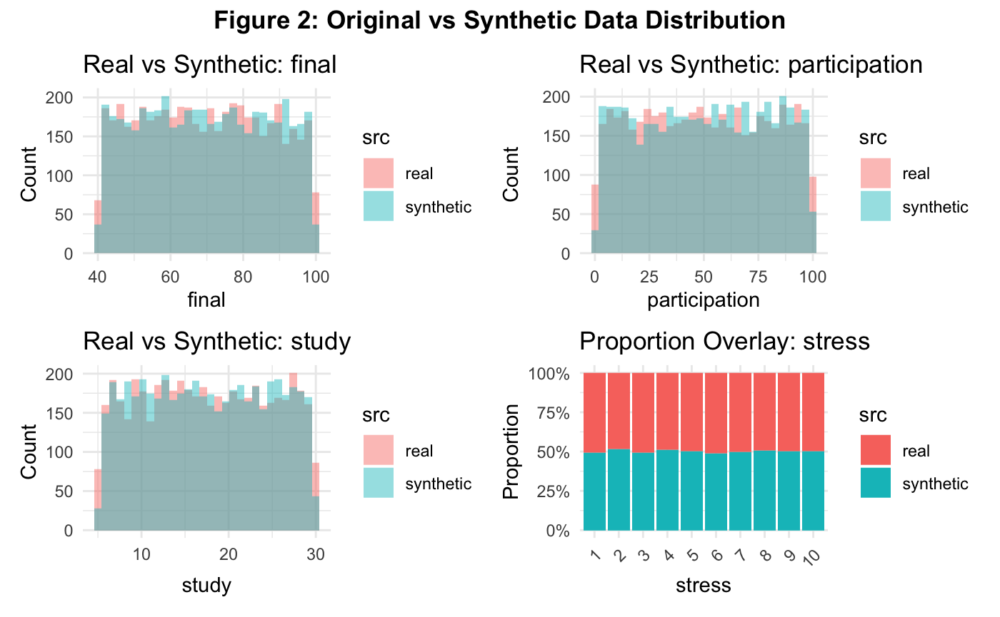

# How Bad Can Informative Missing Values Be?
### A Sensitivity Analysis of MNAR Data in Predictive Modeling

## TL;DR

**Problem:** Real-world ML data often violate MAR assumptions; MNAR missingness can silently break models.

**Approach:** Monte Carlo simulation using synthetic data generated via Gaussian copulas, with controlled MNAR mechanisms applied to features of varying importance.

**Key Findings:**
- MNAR is *not inherently catastrophic*
- Damage scales with **feature importance**, not just missingness rate
- Standard PMM imputation fails when unique signal is lost (−11% accuracy at 70% MNAR)
- Correctly specified delta adjustment recovers ~87% of lost performance
- Incorrect assumptions can be worse than missing data itself

**Why it matters:** Demonstrates statistical judgment beyond “apply imputation and train model.”

---

## Overview

Missing data is a pervasive challenge in real-world machine learning systems. While many pipelines assume data are **Missing At Random (MAR)**, real deployments often violate this assumption, leading to **Missing Not At Random (MNAR)** mechanisms where the probability of missingness depends on unobserved values themselves.

This project investigates the practical question:

> **How bad can informative missing values be, and under what conditions does standard imputation fail or succeed?**

Using a **Monte Carlo simulation framework** grounded in a real student performance dataset, we study how predictive degradation depends on:
- **Feature importance** (correlation with the target), and
- **Missingness intensity** (25%–70%).

We further evaluate whether **domain-informed sensitivity analysis (delta adjustment)** can recover lost signal—and demonstrate how incorrect assumptions can amplify bias beyond the missingness itself.

---

## Key Contributions

- End-to-end **Monte Carlo simulation framework** for MNAR analysis
- Controlled **feature-importance-aware missingness scenarios**
- Empirical comparison of **Predictive Mean Matching (PMM)** vs. **delta-adjusted sensitivity analysis**
- Quantification of **performance risk under mis-specified MNAR assumptions**
- Clear separation of *data damage*, *repair*, and *evaluation* phases

---

## Data Foundation & Problem Setup

The study is based on a real-world **student grading dataset** (5,000 observations) containing demographic, behavioral, and academic variables.

To align with predictive modeling objectives, the original letter-grade outcome (A–F) was recoded into a **binary classification target**:
- **Pass (1)**: A, B, C  
- **Fail (0)**: D, F  

From the original predictors, ten variables were retained to balance realism and parsimony:
- **Demographics**: age, internet access, parents’ education, family income  
- **Behavioral**: study hours, sleep hours, stress level  
- **Academic**: participation score, midterm score, final exam score  

A heterogeneous correlation structure was confirmed, ensuring limited redundancy among predictors—an important condition for evaluating imputation effectiveness.

---

## Synthetic Data Generation

To enable controlled experimentation, synthetic datasets were generated using a **Gaussian copula**, preserving the multivariate dependence structure of the real data while allowing flexible marginal distributions.

Outcome labels were generated using a logistic regression model fitted to the original dataset.  
Distributional alignment between empirical and synthetic data was visually validated, ensuring that observed effects are attributable to missingness mechanisms rather than simulation artifacts.

---

## MNAR Scenario Design

We designed **behaviorally plausible MNAR mechanisms** to reflect real reporting patterns.

### Univariate MNAR Scenarios
- **High correlation**: Final exam score missing from the upper tail  
  *(high-performing students withholding results)*  
- **Moderate correlation**: Participation score missing from the lower tail  
  *(low engagement underreporting)*  
- **Low correlation**: Study hours missing from the lower tail  

### Multivariate MNAR Scenarios
- **High-impact**: Final exam, midterm, and participation missing simultaneously  
- **Low-impact**: Stress, sleep, and study hours missing together  

Each scenario was evaluated at **25%, 40%, 55%, and 70% missingness**, enabling systematic analysis of missingness intensity.

---

## Imputation Strategies Evaluated

### 1. Predictive Mean Matching (PMM)
A standard MAR/MCAR imputation baseline.  
To reflect realistic deployment, the **target variable was excluded** from the imputation model.

### 2. Delta Adjustment (Sensitivity Analysis)
A post-imputation shift of one standard deviation applied to PMM-imputed values:
- **Correct direction**: Counteracts the MNAR mechanism (informed intervention)
- **Incorrect direction**: Reinforces bias (mis-specified intervention)

This design isolates the value—and risk—of incorporating domain knowledge under MNAR.

---

## Monte Carlo Simulation Architecture

Each experiment was repeated over **500 Monte Carlo iterations**:

1. Generate a synthetic dataset (5,000 observations)
2. Train a **baseline logistic regression** on complete data (performance ceiling)
3. Inject MNAR defects into the training set only
4. Repair datasets using each imputation strategy
5. Train models on repaired data
6. Evaluate all models on a **fully observed test set** (accuracy, AUC)

This structure ensures fair and interpretable comparisons.

---

## Key Results & Insights

### 1. MNAR Is Not Inherently Catastrophic
When missingness affects **low-correlation predictors**, performance degradation is minimal—even at high missingness levels.

### 2. Feature Importance Drives Damage
When MNAR removes **high-value predictors with unique signal**, performance collapses non-linearly.  
At 70% missingness in high-impact scenarios, standard PMM lost **~11 percentage points in accuracy**.

### 3. Standard Imputation Can Degenerate into Noise
With weak inter-feature correlations and the target excluded, PMM lacked sufficient auxiliary information, effectively injecting noise rather than recovering signal.

### 4. Domain Knowledge Can Recover Most of the Signal
Correctly applied delta adjustment recovered **~87% of lost performance**, outperforming standard imputation despite its simplicity.

### 5. Wrong Assumptions Are Worse Than Missing Data
Mis-specified delta adjustments caused accuracy to fall **below the PMM baseline**, demonstrating that incorrect MNAR assumptions can amplify bias beyond the missingness itself.

---

## Practical Takeaways

- The harm of MNAR is **conditional**, not absolute
- Standard imputation fails when missing variables carry **unique predictive signal**
- Sensitivity analysis is powerful but **high-risk without domain understanding**
- Handling MNAR is not just a technical task—it is a **modeling decision problem**

---

## Project Structure
- `analysis/` : RMarkdown report (main narrative)
- `R/` : reusable functions (data prep, synthetic generation, MNAR, imputation, simulation, evaluation)
- `data/` : dataset (Student grading dataset from Kaggle)
- `figures/` : saved plots used in the report
- `results/` : simulation outputs